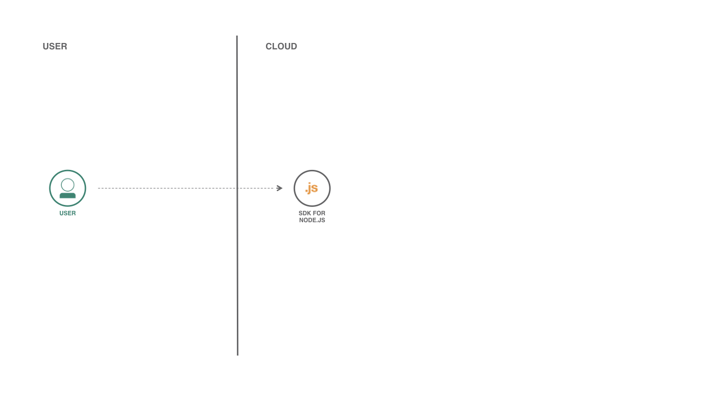

# Deploy your website

[](https://cloud.ibm.com)
[](https://developer.ibm.com/?s=nodejs/)

Use this application to deploy your webiste on cloud. Besides that, it's possible to connect your `custom domain` (.com, .io, .dev, etc) into your website in order to available your content through your domain.



## Components and technologies

* [Node.js](https://developer.ibm.com/?s=nodejs): Platform built on the Google Chrome JavaScript engine to easily build fast and scalable network applications.

## Deploy to the cloud

You can click the button below to deploy the server to the cloud. If you want to learn more, you can read the [blog](https://medium.com/ibmdeveloperbr/o-que-e-a-ibm-cloud-e-como-subir-a-sua-primeira-aplicacao-na-nuvem-41bfd260a2b7) about IBM Cloud.

[](https://cloud.ibm.com/devops/setup/deploy?repository=https://github.com/victorshinya/website-base)

## Run your website

You need to install locally, paste/move your websit into `public` folder and then run the deploy script.

### 1. Download the app

```sh
git clone https://github.com/victorshinya/website-base.git
cd website-base
```

### 2. Paste your front-end

Paste your code (HTML, CSS, and JS files) into `public` folder.

### 3. Deploy your website

Run the script below to deploy your website.

```sh
ibmcloud cf push
```

## Run locally

To run locally, you need to run the commands below. After that, access the link on http://localhost:3000.

```sh
npm install
npm start
```

## License

MIT License

Copyright (c) 2019 Victor Shinya
